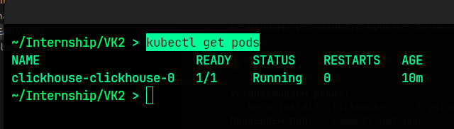
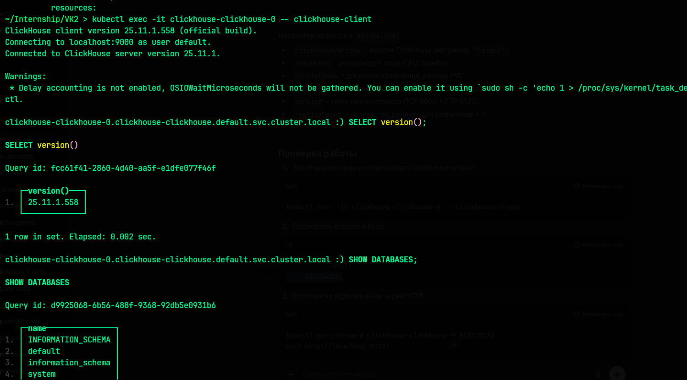
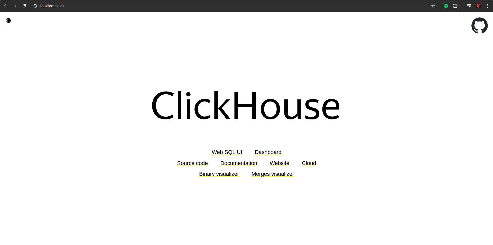

# Цель 

Необходимо реализовать простое автоматическое разворачивание базы данных ClickHouse в Kubernetes

## Установка 

Устанавливаем релиз: 
`  helm install clickhouse ./ -f values.yaml `
Проверяем под: ` kubectl get pods `

## Настройки

Настройки хранятся в values.yaml:

* clickhouseVersion – версия ClickHouse (например "latest").

* resources – ресурсы для пода (CPU, память).

* persistence – дисковое хранилище, размер PVC.

* users – пользователи ClickHouse, их пароли и права.

* service – тип и порты сервиса (TCP 9000, HTTP 8123).

* replicaCount – количество реплик (для single-node = 1).

## Проверка работы

1. Зайти внутрь пода и использовать ClickHouse-клиент и проверяем версию и базу:
` kubectl exec -it clickhouse-clickhouse-0 -- clickhouse-client `

2. Подключение через HTTP:
` kubectl port-forward clickhouse-clickhouse-0 8123:8123 `
